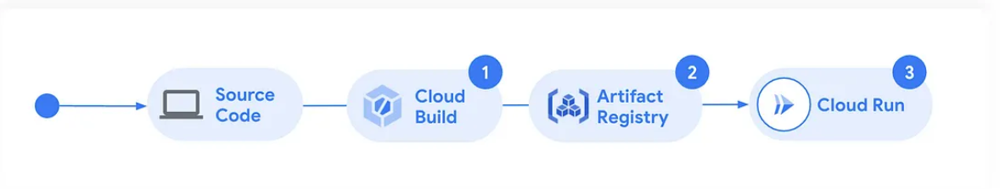

# Build a planet scale, global architecture for modern apps on Google Cloud

You can read my full Medium post: [Build a planet scale, global architecture for modern apps on Google Cloud](https://medium.com/google-cloud/build-a-planet-scale-global-architecture-for-modern-apps-on-google-cloud-96561750cba4)

## Multi Region Demo powered by Cloud Run Backend

This is a sample application that runs on Cloud Run as a Run Function. It can be deployed across multi-regions or a single region. This is the simplest configuration. Cloud Run is deployed to a single region and clients use it's built in HTTPS endpoint to interact.


You can improve the architecture by adding a Load Balancer in front, which allows you to deploy Cloud Armor (Layer 7 Web Application Firewall) for a fully customizable security solution.


Finally, deploy the stack across multiple regions to route traffic to the user and increase availibty


## Table of Contents

* [Directory contents](#directory-contents)
* [Getting started with VS Code](#getting-started-with-vs-code)

## Directory contents
* `launch.json` - the required Cloud Code configurations
* `index.js` - This is the entry point of the application. When the function is invoked code execution beins here.
* `package.json` - includes configures necessary dependencies, including the Functions framework and Firestore. It also configures local emulation settings to allow local debugging.

## Build and Test the Run Function locally

1. Make sure you install the Cloud Code Plugin
2. Run a `npm install` to deploy all dependencies locally
3. Run `npm start` to deploy & run the function locally

You can invoke the function at `http://localhost:8080/`.


The sample code performs the following:
   1. Looks for an authentication header: `x-goog-authenticated-user-email`.  This is delivered by IAP once a user successfully authenticates via IAP
   2. Queries the Compute Metadata service to get info about where the Run Instance is serving from
   3. Executes a get to Firestore to fetch a document with ID that matches the incoming auth info from the header `x-goog-authenticated-user-email`
   4. Sleeps for 3 seconds to simulate real world load
   5. Returns a JSON response with all data from the Firestore document and Compute metadata


You are now ready to deploy to Google Cloud!

### Before you begin

1. If you're new to Google Cloud, you can also use this template as a starting point. These are the prerequisites:

1. Make sure that billing is enabled for your Cloud project. Learn how to [check if billing is enabled on a project](https://cloud.google.com/billing/docs/how-to/verify-billing-enabled).

1. [Enable the following APIs](https://pantheon.corp.google.com/projectselector2/apis/enableflow?apiid=cloudfunctions,cloudbuild.googleapis.com,artifactregistry.googleapis.com,run.googleapis.com,logging.googleapis.com,pubsub.googleapis.com&redirect=https:%2F%2Fcloud.google.com%2Ffunctions%2Fdocs%2Fcreate-deploy-nodejs):

    * Cloud Functions
    * Cloud Build
    * Artifact Registry
    * Cloud Run
    * Logging
    * Pub/Sub

#### Create the function manually

To create a new function manually using the Google Console, follow these steps:

1. Browse to the Cloud Run Console (https://console.cloud.google.com/run) and click  **Write a Function**

2. Choose **Node.js 22** and **Allow Unauthenticated invocations**. Under Ingress, choose **Internal** + **Allow traffic from ALBs**

3. Click **Create**.

4. Update the index.js and package.json files to match [index.js](index.js) and [package.json](package.json)

5. Click **Save and redeploy**

#### Deploy the function using the gcloud CLI

To deploy a function using the gcloud CLI: 

1. Run the gcloud command
   ```bash
      gcloud run deploy test-function \
      --source . \
      --function helloHttp \
      --base-image nodejs22 \
      --region us-east4 \
      --allow-unauthenticated \
      --ingress=internal-and-cloud-load-balancing
   ```

See docs for more info [here.](https://cloud.google.com/run/docs/deploy-functions)

#### Confirm deployment success
The function's deployment may take a few minutes. This is the process:



1. Browse to the Cloud Build Console. You should see a build kick off. Check the logs for progress.


2. Check Artifact Registry. Cloud Build will push the actual deployment image when complete into a folder `cloud-run-source-deploy` matching the region you choose at deployment (us-east4 in this case).


3. Confirm successful deployment at Cloud Run


#### Automate the entire architcture using Pulumi IaC

See [this GitHub project](https://github.com/georgemao/sample-next-react-webapp) for code and instructions